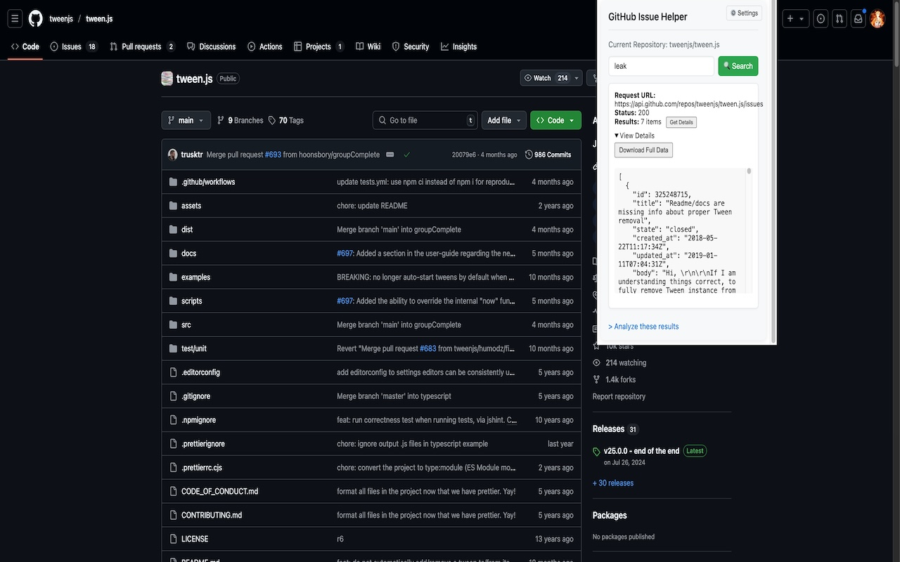
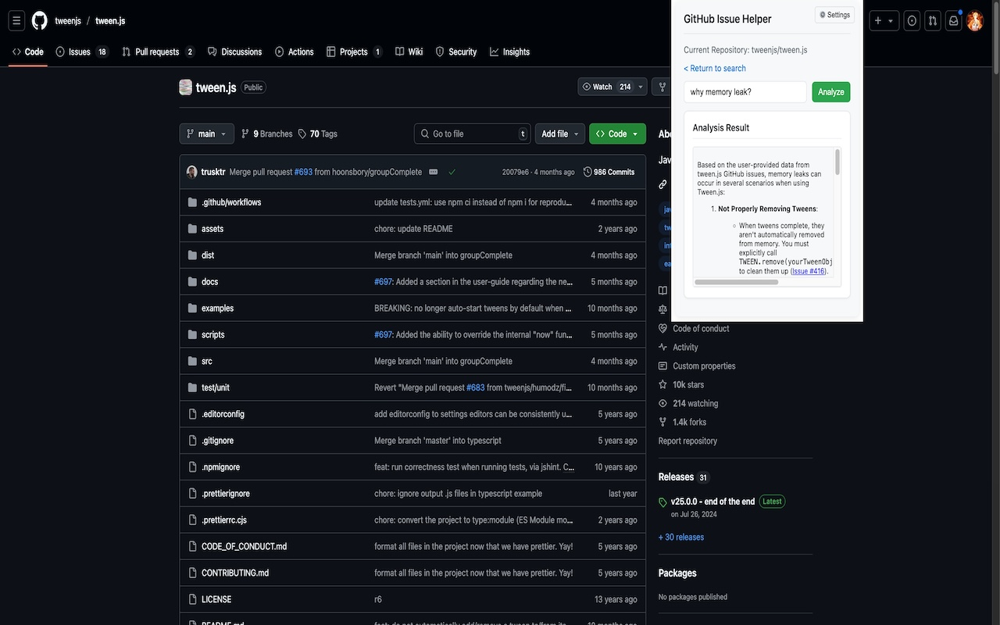
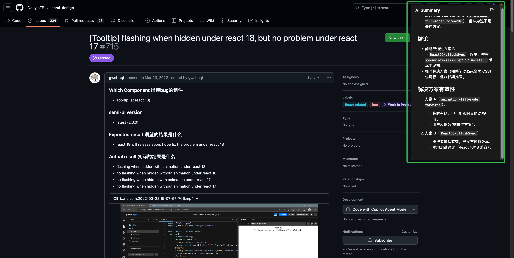
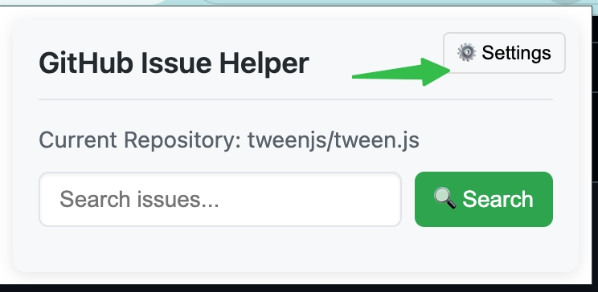
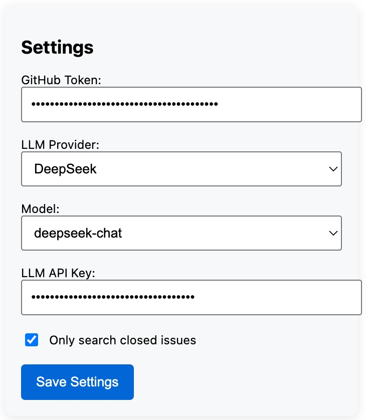

# GitHub Issue Helper

A browser extension that helps you search, analyze and manage GitHub issues more efficiently.

## Features

- 🔍 Search GitHub issues with advanced filters
- 📊 Analyze issue content using AI (supports OpenAI and DeepSeek)
- ⚙️ Customizable LLM settings (API endpoints and models)
- 📥 Export issue data as JSON
- 🚀 Stream AI responses in real-time

## Installation

1. Clone this repository
```bash
git clone https://github.com/your-repo/github-issue-helper.git
```

2. Install dependencies
```bash
npm install
```

3. Build the extension
```bash
npm run build
```

4. Load the extension in Chrome/Edge:
   - Open `chrome://extensions/`
   - Enable "Developer mode"
   - Click "Load unpacked" and select the `dist` folder

## Configuration

1. Open the extension popup
2. Go to Settings tab
3. Configure:
   - GitHub access token
   - LLM provider (OpenAI/DeepSeek/Custom)
   - API keys and endpoints
   - Search preferences (e.g. only closed issues)

## Usage

1. Navigate to any GitHub repository page
2. Click the extension icon
3. Search issues by keywords
4. Click "Analyze" to get AI insights

## Screenshots

### Main Features


*Search GitHub issues with filters*


*Get AI-powered insights on issues*



*Analysis Current Issue Page and Generate a Report*

### Step-by-Step Guide

1. 
   *Open the extension settings*

2. 
   *Configure and save your settings*

3. 
   *Search issues and view details*

4. 
   *Get AI-powered analysis of issues*

## Development

```bash
# Run dev server
npm run dev

# Build for production
npm run build

# Lint code
npm run lint
```

## License

MIT